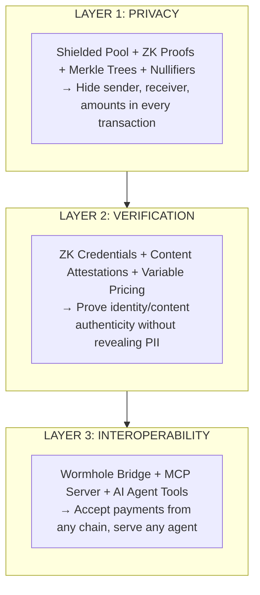
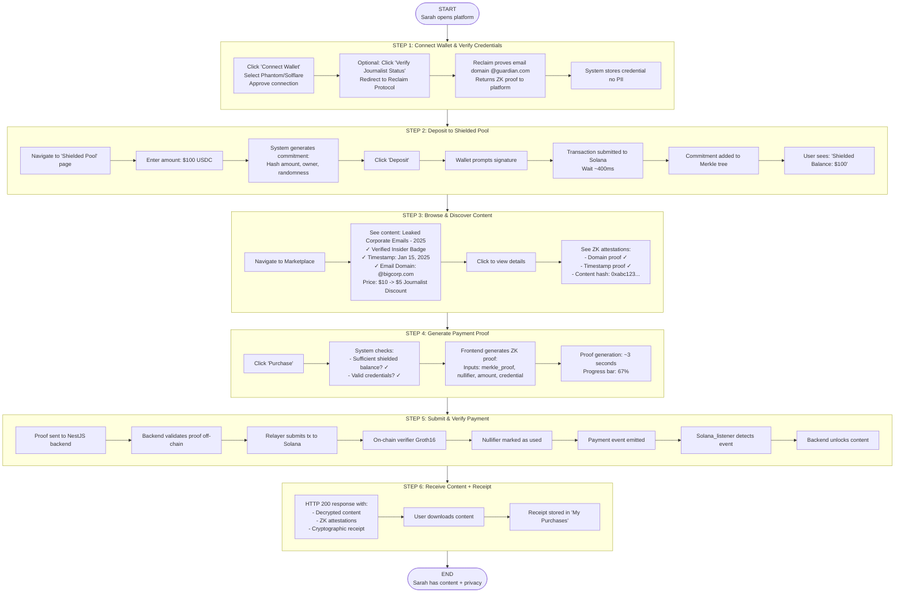
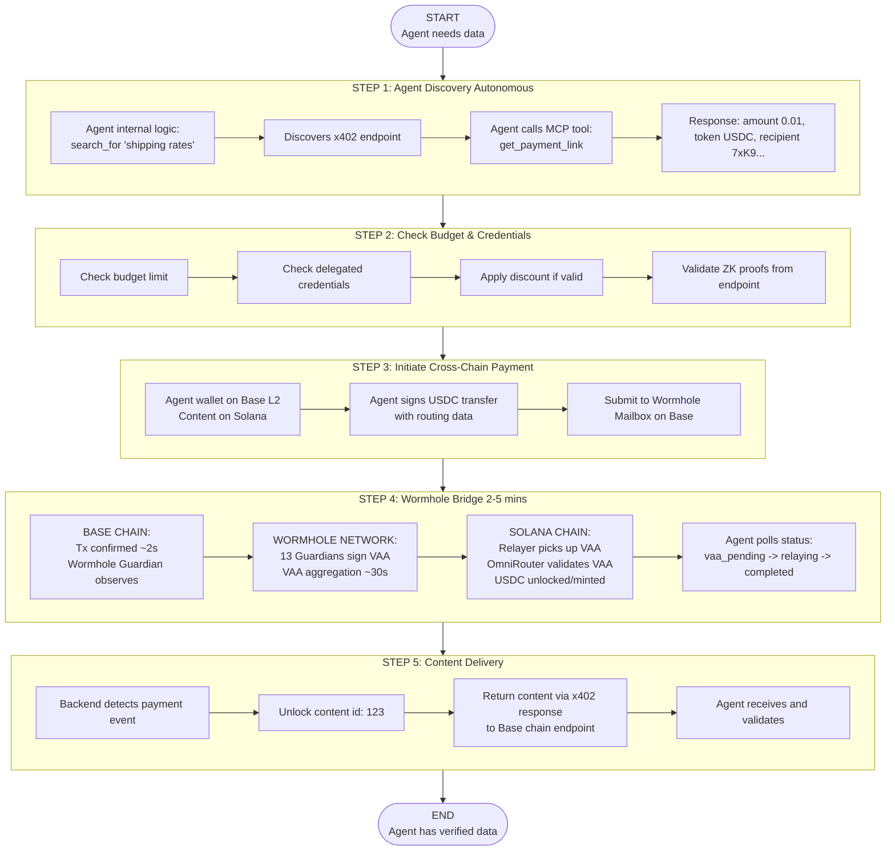
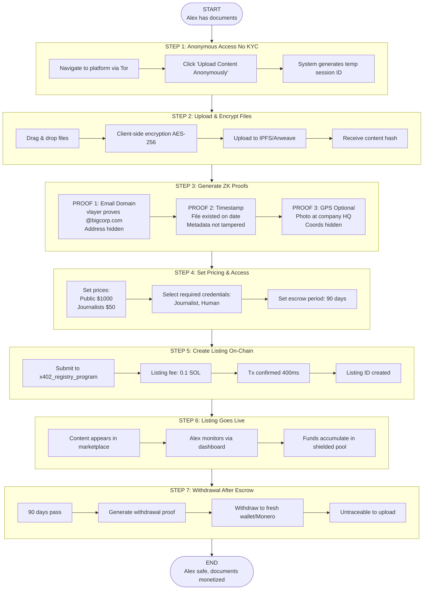
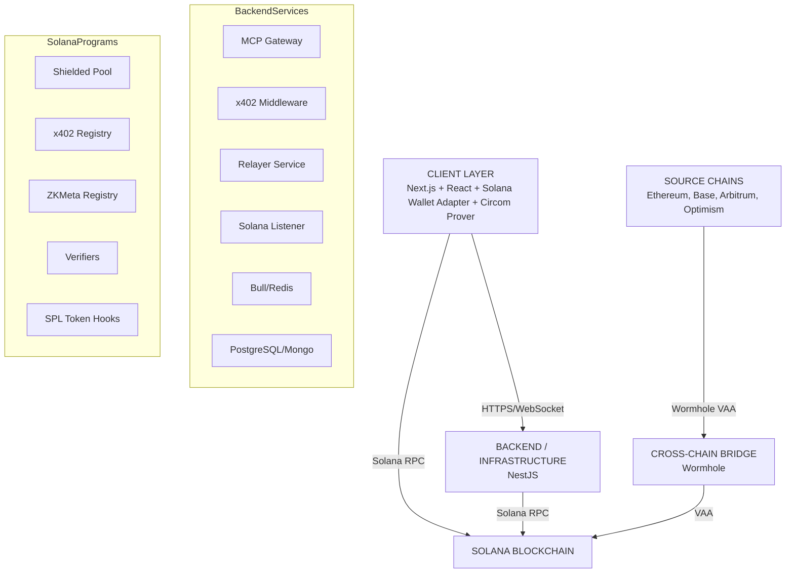

# Solana Omni-Shield x402

## Production-Grade Project Documentation

### Table of Contents

1. [Executive Summary](#executive-summary)
2. [Problem Statement](#problem-statement)
3. [Solution Overview](#solution-overview)
4. [User Personas](#user-personas)
5. [User Flows](#user-flows)
6. [Technical Architecture](#technical-architecture)
7. [Feature Specifications](#feature-specifications)
8. [Implementation Plan](#implementation-plan)
9. [Success Metrics](#success-metrics)
10. [Go-to-Market Strategy](#go-to-market-strategy)

---

## Executive Summary

Solana Omni-Shield x402 is a next-generation payment protocol that unifies privacy-preserving payments, zero-knowledge credential verification, and cross-chain interoperability on Solana. Built for the AI agent economy, our platform enables:

• **100% Private Payments** - Zero-knowledge proofs hide sender, receiver, and amounts
• **Verified Content Marketplace** - Cryptographic proof of authorship, timestamps, and credentials
• **Cross-Chain Payments** - AI agents pay from any blockchain via Wormhole
• **AI-Native Protocol** - MCP (Model Context Protocol) integration for autonomous agents

### Key Innovation

We're the first platform to combine privacy, verification, and interoperability in a single protocol optimized for Solana's speed (400ms finality) and cost ($0.00025/tx).

### Market Opportunity

• **AI Agent Economy**: $2B+ by 2026
• **Privacy Payments**: $500M+ market, growing 45% YoY
• **Content Verification**: $300M+ market
• **Target Users**: 100K+ AI agents, 50K+ journalists/whistleblowers, 1M+ privacy-conscious users

---

## Problem Statement

### Current Pain Points

**1. Privacy Deficit**
Traditional blockchain payments expose:
• Sender wallet addresses
• Recipient wallet addresses
• Transaction amounts
• Payment timing
• Transaction history
_Impact: Whistleblowers, journalists, and privacy-conscious users cannot safely monetize sensitive content._

**2. Trust & Verification Gap**
No cryptographic way to:
• Prove content authenticity without revealing identity
• Verify credentials for variable pricing
• Confirm timestamps or GPS data
• Establish content provenance
_Impact: Content buyers can't verify legitimacy; sellers can't prove authenticity safely._

**3. Chain Fragmentation**
• AI agents locked to single blockchain ecosystems
• Content providers miss 90% of potential customers
• Complex UX for multi-chain payments
• High friction, abandoned transactions
_Impact: Limited market reach, reduced revenue, poor user experience._

**4. No AI-Native Standards**
Existing payment protocols require:
• Manual wallet interactions
• Complex cryptographic operations
• Custom integration for each agent
• No standardized tool interfaces
_Impact: AI agents can't autonomously purchase verified content._

---

## Solution Overview

### Three-Layer Architecture



### Core Components

**On-Chain (Solana Programs - Rust/Anchor)**
• `shielded_pool_program` - Privacy layer with Merkle tree state
• `x402_registry_program` - Maps payments to content
• `zk_meta_registry_program` - Manages verification keys
• `verifiers` - Groth16 proof verification (Phase 1 & 2)
• `access_controllers` - Content unlock logic
• `token_hooks` - SPL Token Extensions for auto-triggers

**Off-Chain (NestJS Backend)**
• `mcp_gateway` - Model Context Protocol server for AI agents
• `relayer_service` - Gasless transaction submission
• `solana_listener` - Event monitoring and indexing
• `proof_generator_async` - Heavy ZK proof computation (Bull/Redis queue)

**ZK Privacy Engine (Circom)**
• `spend.circom` - Shielded payment logic
• `credential.circom` - Identity/credential verification

**Cross-Chain Bridge**
• Wormhole Guardian Network for VAA verification
• Base/Ethereum → Solana USDC bridging

---

## User Personas

### Persona 1: Investigative Journalist - "Sarah Chen"

**Demographics**
• Age: 32
• Role: Senior Investigative Reporter, The Guardian
• Location: Hong Kong
• Tech Savvy: High

**Goals**
• Access leaked documents from anonymous sources
• Verify document authenticity before publication
• Protect source identity at all costs
• Stay within legal/ethical guidelines
• Get verified discounts (media credentials)

**Pain Points**
• Traditional payment methods expose her identity
• Can't verify if leaked docs are authentic
• Sources fear being traced through payments
• High costs for single-use information
• Complex crypto workflows slow down reporting

**How We Help**

- **Private Payments** - Sarah uses shielded pool; source never sees her wallet
- **Credential Verification** - Proves she's a journalist for 50% discount without revealing personal info
- **Content Attestations** - ZK proofs show document timestamp, email domain proof
- **Fast Settlements** - 400ms Solana finality means instant access

**User Journey**

1. Connects Phantom wallet to platform
2. Verifies journalist credentials via Reclaim Protocol (one-time)
3. Deposits $100 USDC into shielded pool
4. Browses marketplace, sees verified "Leaked Corporate Emails - 2025"
5. Sees discount price ($5 instead of $10) due to credentials
6. Generates ZK proof of payment + credentials
7. Receives encrypted content + cryptographic receipt
8. Validates content proofs (sender domain, timestamp)

### Persona 2: Anonymous Whistleblower - "Alex" (Pseudonym)

**Demographics**
• Age: Unknown
• Role: Corporate Insider (Fortune 500)
• Location: Undisclosed
• Tech Savvy: Medium

**Goals**
• Monetize sensitive internal documents
• Prove document authenticity without revealing identity
• Receive payment without trace
• Ensure only verified journalists can access
• Maintain plausible deniability

**Pain Points**
• Traditional platforms require KYC (unacceptable)
• No way to prove "insider status" safely
• Bank transfers/PayPal expose identity
• Fear of corporate retaliation or legal action
• Can't verify buyer legitimacy

**How We Help**

- **Anonymous Listings** - No identity required to create listings
- **ZK Email Proofs** - Proves email came from @company.com domain without revealing address
- **Shielded Withdrawals** - Receives funds privately, can withdraw to Monero
- **Buyer Verification** - Only approved journalists (with credentials) can purchase
- **Untraceable** - On-chain analysis can't link payments to identity

**User Journey**

1. Creates anonymous account (no email required)
2. Uploads encrypted documents to IPFS/Arweave
3. Generates ZK proof of insider status:
   • Email domain proof (vlayer ZK Email)
   • Timestamp attestation (shows recent access)
   • Optional: GPS proof (from company office location)
4. Sets pricing: $1000 public, $50 for verified journalists
5. Lists content with "Verified Insider" badge
6. When journalist purchases:
   • Receives payment into shielded pool
   • System auto-releases decryption key
   • No personal info exchanged
7. Withdraws to cold wallet after 90 days (opsec delay)

### Persona 3: AI Research Agent - "ResearchBot-7"

**Demographics**
• Type: Autonomous AI Agent
• Owner: Hedge Fund Quantitative Analyst
• Task: Gather alternative data for trading signals
• Budget: $500/month automated spending
• Integration: Claude MCP Server

**Goals**
• Autonomously purchase verified data sources
• Access real-time IoT sensor data (shipping ports, traffic)
• Verify data provenance before ingestion
• Execute payments without human intervention
• Maintain low operational costs

**Pain Points**
• Manual payment approval slows research
• Can't verify data quality before purchase
• Many data sources on different blockchains
• Traditional APIs don't accept crypto
• No standardized tool interface

**How We Help**

- **MCP Integration** - Agent calls simple tools: `tool.pay_for_data()`
- **Cross-Chain** - Owner funds agent on Ethereum; agent pays on Solana
- **Automated Verification** - Agent checks ZK attestations programmatically
- **Bulk Discounts** - Inherits owner's credentials for reduced pricing
- **Fast & Cheap** - $0.00025/tx means $500 budget = 2M transactions

**User Journey (Autonomous)**

1. Setup (One-time by human owner):
   • Deploy agent with MCP server endpoint
   • Fund agent wallet with $500 USDC on Base
   • Delegate credentials via EAS attestation
   • Set spending rules: max $10/item, require ZK proofs
2. Autonomous Operation:
   ```python
   # Agent's internal logic
   while researching:
       data_source = find_relevant_data()
       if data_source.has_zk_proof():
           # Call MCP tool
           result = mcp.tools.get_payment_link(
               endpoint=data_source.url,
               network="solana"
           )
           # Agent wallet signs automatically
           payment_proof = generate_proof_with_credentials()

           # Cross-chain payment (Base → Solana)
           content = mcp.tools.pay_and_fetch(
               proof=payment_proof,
               cross_chain=True
           )

           # Verify attestations
           if verify_attestations(content.metadata):
               ingest_data(content)
   ```
3. Human reviews weekly:
   • Dashboard shows: "Agent purchased 142 data sources, $247 spent"
   • All verified with ZK proofs
   • No failed transactions

### Persona 4: IoT Data Provider - "Smart Sensor Network Inc."

**Demographics**
• Type: B2B Company
• Service: GPS-verified shipping container tracking
• Customers: Supply chain analytics firms, hedge funds
• Tech Stack: IoT sensors + Edge compute
• Data Volume: 10M data points/day

**Goals**
• Monetize real-time sensor data
• Prove data authenticity (GPS, timestamp)
• Automate payment collection
• Serve customers on multiple blockchains
• Minimize operational overhead

**Pain Points**
• Customers doubt data accuracy
• Manual invoicing/payment reconciliation
• Integration burden for each blockchain
• High payment processing fees
• Delayed payments (Net-30 terms)

**How We Help**

- **ZK Attestations** - GPS + timestamp proofs embedded in data
- **Instant Settlement** - Receive payment in 400ms (Solana finality)
- **Cross-Chain** - Customers pay from any chain via Wormhole
- **Automated** - SPL Token Hooks auto-unlock data on payment
- **Low Fees** - $0.00025/tx vs 2-3% credit card fees

**User Journey**

1. Setup:
   • Deploy Solana program with access controls
   • Generate ZK circuits for GPS + timestamp verification
   • Integrate with existing IoT backend
2. Data Publishing:

   ```javascript
   // Sensor publishes data every 10 seconds
   const dataPoint = {
     container_id: "MSCU1234567",
     gps: { lat: 1.2897, lon: 103.8501 },
     timestamp: Date.now(),
     sensor_reading: { temp: 22.5, humidity: 65 },
   };

   // Generate ZK proof
   const proof = await generateLocationProof({
     gps: dataPoint.gps,
     timestamp: dataPoint.timestamp,
     sensor_signature: privateKey.sign(dataPoint),
   });

   // Publish to x402 endpoint
   await x402Server.registerContent({
     data: encrypt(dataPoint),
     proof: proof,
     price: 0.01, // $0.01 per data point
     required_credential: "supply_chain_analyst",
   });
   ```

3. Automated Sales:
   • Customer's AI agent discovers endpoint
   • Agent verifies ZK proof of GPS accuracy
   • Agent pays via cross-chain bridge
   • SPL Token Hook auto-decrypts and delivers data
   • Company receives USDC instantly

---

## User Flows

### Flow 1: Private Content Purchase (Journalist)



**Privacy Guarantees:**
• Whistleblower can't see Sarah's wallet address
• On-chain analysis can't link payment to Sarah
• Only nullifier visible (meaningless without secret)
• No metadata leaked (amount hidden in ZK proof)

### Flow 2: Cross-Chain AI Agent Purchase



**Key Innovation:** Agent never leaves its native chain (Base), yet accesses Solana-native content seamlessly.

### Flow 3: Whistleblower Content Upload



**Safety Features:**
• No email/phone/ID required
• Tor-friendly (no IP logging)
• Client-side encryption (platform never sees plaintext)
• ZK proofs (authenticity without identity)
• Escrow period (delays forensic tracing)
• Shielded withdrawals (untraceable payments)

---

## Technical Architecture

### System Overview



### ZK Privacy Engine (Circom Circuits)

**Circuit 1: `spend.circom` (Shielded Payment)**

```circom
pragma circom 2.1.0;
include "poseidon.circom";
include "merkletree.circom";

template Spend(levels) {
    // Public inputs
    signal input root;          // Merkle tree root
    signal input nullifierHash; // Prevents double-spend
    signal input recipient;     // Payment recipient
    signal input amount;        // Payment amount

    // Private inputs
    signal input secret;        // Owner's secret
    signal input pathElements[levels]; // Merkle proof
    signal input pathIndices[levels];  // Merkle path

    // 1. Compute commitment
    component commitmentHasher = Poseidon(2);
    commitmentHasher.inputs[0] <== secret;
    commitmentHasher.inputs[1] <== amount;
    signal commitment <== commitmentHasher.out;

    // 2. Verify commitment exists in tree
    component tree = MerkleTreeChecker(levels);
    tree.leaf <== commitment;
    tree.root <== root;
    for (var i = 0; i < levels; i++) {
        tree.pathElements[i] <== pathElements[i];
        tree.pathIndices[i] <== pathIndices[i];
    }

    // 3. Compute nullifier
    component nullifierHasher = Poseidon(2);
    nullifierHasher.inputs[0] <== commitment;
    nullifierHasher.inputs[1] <== secret;
    nullifierHash === nullifierHasher.out;
}

component main {public [root, nullifierHash, recipient, amount]} = Spend(20);
```

**Circuit 2: `credential.circom` (Identity Verification)**

```circom
pragma circom 2.1.0;
include "eddsa.circom";
include "poseidon.circom";

template CredentialVerification() {
    // Public inputs
    signal input issuerPubKey[2]; // Trusted issuer public key
    signal input credentialType;  // Type of credential

    // Private inputs
    signal input signature[64];   // Issuer signature
    signal input userAttribute;   // User attribute (hidden)

    // Verify signature
    component verifier = EdDSAPoseidonVerifier();
    verifier.A[0] <== issuerPubKey[0];
    verifier.A[1] <== issuerPubKey[1];
    for (var i = 0; i < 64; i++) {
        verifier.S[i] <== signature[i];
    }
    verifier.M <== userAttribute;
    verifier.enabled <== 1;

    // Prove attribute matches credential type
    component typeHasher = Poseidon(1);
    typeHasher.inputs[0] <== userAttribute;
    credentialType === typeHasher.out;
}

component main {public [issuerPubKey, credentialType]} = CredentialVerification();
```

### Smart Contract Architecture (Rust/Anchor)

**Program 1: `shielded_pool_program.rs`**

```rust
use anchor_lang::prelude::*;
use anchor_spl::token::{self, Token, TokenAccount, Transfer};

#[program]
pub mod shielded_pool {
    use super::*;

    pub fn initialize(ctx: Context<Initialize>) -> Result<()> {
        let pool = &mut ctx.accounts.pool;
        pool.authority = ctx.accounts.authority.key();
        pool.merkle_root = [0u8; 32];
        pool.tree_height = 20;
        pool.next_index = 0;
        Ok(())
    }

    pub fn deposit(
        ctx: Context<Deposit>,
        commitment: [u8; 32],
        amount: u64,
    ) -> Result<()> {
        // Transfer tokens to pool
        let cpi_ctx = CpiContext::new(
            ctx.accounts.token_program.to_account_info(),
            Transfer {
                from: ctx.accounts.user_token.to_account_info(),
                to: ctx.accounts.pool_token.to_account_info(),
                authority: ctx.accounts.user.to_account_info(),
            },
        );
        token::transfer(cpi_ctx, amount)?;

        // Add commitment to tree
        let pool = &mut ctx.accounts.pool;
        let mut tree_data = ctx.accounts.merkle_tree.data.borrow_mut();
        // Insert leaf at next_index
        let leaf_index = pool.next_index;
        tree_data[leaf_index as usize * 32..(leaf_index as usize + 1) * 32]
            .copy_from_slice(&commitment);

        // Update merkle root (simplified - use proper Merkle tree lib)
        pool.merkle_root = compute_root(&tree_data, leaf_index);
        pool.next_index += 1;

        emit!(DepositEvent {
            commitment,
            leaf_index,
            root: pool.merkle_root,
        });
        Ok(())
    }

    // ... settle_intent implementation ...
}
```

**Program 2: `x402_registry_program.rs`**

```rust
use anchor_lang::prelude::*;

#[program]
pub mod x402_registry {
    use super::*;

    pub fn register_content(
        ctx: Context<RegisterContent>,
        content_hash: [u8; 32],
        pricing: PricingTiers,
        required_credentials: Vec<CredentialType>,
        zk_proofs: Vec<ZkProof>,
    ) -> Result<()> {
        let listing = &mut ctx.accounts.listing;
        listing.creator = ctx.accounts.creator.key();
        listing.content_hash = content_hash;
        listing.pricing = pricing;
        listing.required_credentials = required_credentials;
        listing.zk_attestations = zk_proofs;
        listing.created_at = Clock::get()?.unix_timestamp;
        listing.purchase_count = 0;

        emit!(ContentRegisteredEvent {
            listing_id: listing.key(),
            content_hash,
            creator: listing.creator,
        });
        Ok(())
    }
}
```

### Backend Architecture (NestJS)

**Key Service: MCP Gateway**

```typescript
// mcp/mcp.service.ts
import { Server } from "@modelcontextprotocol/sdk/server/index.js";
import { StdioServerTransport } from "@modelcontextprotocol/sdk/server/stdio.js";

@Injectable()
export class McpService {
  private server: Server;

  constructor(
    private solanaService: SolanaService,
    private paymentService: PaymentService
  ) {
    this.initializeServer();
  }

  private initializeServer() {
    this.server = new Server(
      {
        name: "omnishield-x402",
        version: "1.0.0",
      },
      {
        capabilities: {
          tools: {},
        },
      }
    );

    // Tool definitions and request handlers...
  }
}
```

---

## Feature Specifications

### Feature 1: Privacy Layer (Shielded Pool)

- **Acceptance Criteria:**
  - User can deposit USDC into shielded pool
  - Commitment added to Merkle tree
  - User can make private payments with ZK proofs
  - Nullifier prevents double-spending
  - On-chain analysis cannot link sender to receiver
  - Transaction finality < 1 second
- **Technical Requirements:**
  - Merkle tree depth: 20 levels (1M leaves)
  - Hash function: Poseidon
  - Proof system: Groth16

### Feature 2: Verification Layer (ZK Credentials)

- **Acceptance Criteria:**
  - User can verify journalist credentials via Reclaim Protocol
  - Credential proof generated without revealing PII
  - Variable pricing applied based on credentials
- **Supported Credential Types:**
  - Identity: Email domain, Organizational membership, Human verification
  - Content Attestations: Timestamp, GPS, Sensor reading

### Feature 3: Cross-Chain Payments (Wormhole)

- **Acceptance Criteria:**
  - User on Base can pay for Solana content
  - USDC automatically bridged via Wormhole
  - Payment settled within 3 minutes
- **Technical Requirements:**
  - Wormhole SDK v3+
  - Guardian Network: 13/19 signatures required

### Feature 4: AI Agent Integration (MCP)

- **Acceptance Criteria:**
  - Claude Desktop can use MCP tools
  - Agent can autonomously discover content
  - Agent can verify ZK proofs programmatically
- **MCP Tools Exposed:**
  - `get_payment_link`
  - `generate_proof_local`
  - `pay_and_fetch`
  - `verify_attestation`

---

## Implementation Plan

### Phase 1: Core Infrastructure (Weeks 1-2)

**Sprint 1 (Week 1): Privacy Layer**

- Shielded pool smart contract (Rust/Anchor)
- ZK circuits (Circom) + proof generation

**Sprint 2 (Week 2): Backend + x402**

- NestJS backend + x402 middleware
- Event listener + indexing

### Phase 2: Verification Layer (Weeks 3-4)

**Sprint 3 (Week 3): Credentials**

- Reclaim Protocol integration
- Credential verification circuits

**Sprint 4 (Week 4): Content Marketplace**

- Content listing UI
- ZK attestation display

### Phase 3: Cross-Chain Integration (Week 5)

**Sprint 5 (Week 5): Wormhole + MCP**

- Wormhole bridge integration
- MCP server implementation
- AI agent demo

---

## Success Metrics

| Technical Metrics        | Target      |
| :----------------------- | :---------- |
| Transaction Finality     | < 1 second  |
| Gas Cost per Transaction | < $0.001    |
| ZK Proof Generation Time | < 5 seconds |
| Cross-Chain Bridge Time  | < 3 minutes |

| Business Metrics (6 months) | Target |
| :-------------------------- | :----- |
| Content Listings            | 1,000+ |
| Active Users (Monthly)      | 5,000+ |
| Transaction Volume          | $500K+ |
| AI Agent Integrations       | 100+   |

---

## Go-to-Market Strategy

**Target Markets (Launch Order)**

1.  **Month 1-3: Early Adopters**
    - Crypto Journalists
    - Privacy Advocates
2.  **Month 4-6: AI Agent Ecosystem**
    - AI Agent Developers
    - IoT Data Providers

**Revenue Streams**

1.  **Platform Fees:** 2% on all transactions
2.  **Listing Fees:** 0.1 SOL per content listing
3.  **Premium Features:** Priority support, analytics
4.  **Enterprise Plans:** Revenue share models
