# Solana Smart Contracts - x402 Privacy & Verification Protocol

## Overview

Production-grade Rust/Anchor programs implementing **privacy-preserving payments**, **ZK credential verification**, and **content access control** on Solana. Optimized for 400ms finality and sub-cent transaction costs.

### Architecture Diagram

```mermaid
graph TB
    subgraph "PRIVACY LAYER"
        SP[Shielded Pool Program<br/>Merkle Tree State]
        ZK1[spend.circom<br/>Payment Proofs]
    end
    
    subgraph "VERIFICATION LAYER"
        REG[x402 Registry Program<br/>Content ↔ Payment Mapping]
        ZK2[credential.circom<br/>Identity Proofs]
        META[ZK Meta Registry<br/>Verification Keys]
    end
    
    subgraph "ACCESS CONTROL"
        VERIFIER[Groth16 Verifiers<br/>Phase 1 & 2]
        ACCESS[Access Controllers<br/>Unlock Logic]
        HOOKS[Token Hooks<br/>Auto-triggers]
    end
    
    ZK1 --> SP
    SP --> REG
    ZK2 --> META
    META --> VERIFIER
    VERIFIER --> ACCESS
    REG --> ACCESS
    ACCESS --> HOOKS
    
    style SP fill:#ffe1e1
    style REG fill:#e1f5ff
    style VERIFIER fill:#fff4e1
    style ACCESS fill:#e1ffe1
```



## 1. Program Structure

### Core Programs

| Program | Location | Purpose | Status |
|---------|----------|---------|--------|
| **shielded_pool_program** | `programs/shielded_pool/` | Privacy layer with Merkle trees | 🔨 In Development |
| **x402_registry_program** | `programs/x402_registry/` | Content-to-payment mapping | 🔨 In Development |
| **zk_meta_registry_program** | `programs/zk_meta_registry/` | Verification key management | 🔨 In Development |
| **verifiers** | `programs/verifiers/` | Groth16 proof verification | 🔨 In Development |
| **access_controllers** | `programs/access_controllers/` | Content unlock logic | 🔨 In Development |

### ZK Circuits (Circom)

Located in `circuits/` folder:

- **spend.circom** - Shielded payment logic (hide sender, receiver, amounts)
- **credential.circom** - Identity/credential verification for variable pricing
- **merkletree.circom** - Merkle tree membership proofs

**Documentation:** See [circuits/docs/Setup_and_Usage.md](circuits/docs/Setup_and_Usage.md)

## 2. Program Specifications

### Shielded Pool Program

**Purpose:** Maintain privacy set with Merkle tree accumulator

**Key Instructions:**
```rust
pub fn deposit(ctx: Context<Deposit>, amount: u64, commitment: [u8; 32]) -> Result<()>
pub fn withdraw(ctx: Context<Withdraw>, proof: Proof, nullifier: [u8; 32]) -> Result<()>
pub fn verify_merkle_proof(ctx: Context<Verify>, path: Vec<[u8; 32]>) -> Result<()>
```

**State Accounts:**
- `MerkleTree` - Root hash, leaf count, depth (32 levels)
- `NullifierSet` - Spent nullifier tracking (prevents double-spend)
- `Commitment` - Individual deposit records

**Security:**
- ✅ Nullifier uniqueness enforcement
- ✅ Merkle proof validation
- ✅ Amount range checks (prevent overflow)

### x402 Registry Program

**Purpose:** Map content IDs to payment sessions

**Key Instructions:**
```rust
pub fn register_content(ctx: Context<Register>, content_id: [u8; 32], price: u64) -> Result<()>
pub fn verify_payment(ctx: Context<Verify>, session_id: [u8; 32]) -> Result<()>
pub fn grant_access(ctx: Context<Grant>, session_id: [u8; 32]) -> Result<()>
```

**State Accounts:**
- `ContentListing` - Price, owner, metadata hash
- `PaymentSession` - Status, access flags, expiry timestamp
- `AccessControl` - Permission matrix

### ZK Verifier Programs

**Purpose:** Verify Groth16 proofs on-chain using alt_bn128 precompiles

**Verification Flow:**
```rust
pub fn verify_spend_proof(ctx: Context<VerifySpend>, proof: Proof, public_inputs: [u8; 32]) -> Result<()> {
    // 1. Load verification key from account
    let vk = &ctx.accounts.verification_key;
    
    // 2. Parse proof points (A, B, C)
    let (a, b, c) = parse_proof(&proof)?;
    
    // 3. Verify pairing equation using Solana syscall
    // e(A, B) == e(alpha, beta) * e(inputs, gamma) * e(C, delta)
    solana_program::alt_bn128::alt_bn128_pairing(&pairing_input)?;
    
    Ok(())
}
```

**Supported Circuits:**
- ✅ `spend_v2` - Latest spend circuit
- ✅ `credential_v2` - Latest credential circuit
- ⚠️ `spend_v1`, `credential_v1` - Legacy (inactive)

## 3. Development Setup

### Prerequisites

```bash
# Install Rust
curl --proto '=https' --tlsv1.2 -sSf https://sh.rustup.rs | sh

# Install Solana CLI
sh -c "$(curl -sSfL https://release.solana.com/stable/install)"

# Install Anchor
cargo install --git https://github.com/coral-xyz/anchor avm --locked
avm install latest
avm use latest

# Install Node dependencies
cd contracts
npm install
```

### Build Programs

```bash
# Build all programs
anchor build

# Build specific program
anchor build -p shielded_pool_program

# Generate TypeScript types
anchor build && anchor-client-gen && mv target/types src/types
```

### Test Programs

```bash
# Run all tests
anchor test

# Test specific program
anchor test --skip-build --skip-deploy --run "yarn test shielded_pool"

# With logging
RUST_LOG=debug anchor test
```

### Deploy Programs

```bash
# Deploy to devnet
anchor deploy --provider.cluster devnet

# Deploy to localnet (for testing)
solana-test-validator &
anchor deploy

# Upgrade program (after changes)
anchor upgrade <PROGRAM_ID> --program-keypair target/deploy/program-keypair.json
```

## 4. Testing Strategy

### Unit Tests (Rust)

Located in `programs/*/src/tests/`

```bash
cargo test
cargo test --package shielded_pool_program
```

### Integration Tests (TypeScript)

Located in `tests/`

```bash
anchor test
```

**Test Coverage Goals:**
- [ ] Deposit → Withdraw flow
- [ ] Merkle tree state updates
- [ ] Nullifier double-spend prevention
- [ ] ZK proof verification (spend + credential)
- [ ] Access control validation
- [ ] Edge cases (overflow, underflow, invalid inputs)

### Security Audits

**Recommended Tools:**
- `cargo-audit` - Check dependencies for CVEs
- `cargo-geiger` - Detect unsafe code usage
- `anchor-lang` built-in checks
- Manual review by Solana security firm (before mainnet)

## 5. Program IDs (Configured)

### Devnet Addresses

```toml
# Anchor.toml
[programs.devnet]
shielded_pool_program = "4DgZE9WQ4qCL9LvTqZ1ZP8Y7F5rJ6XqT9K2MxNvW3jCB"
x402_registry_program = "7vKZ3qH5VqN8L9rT4mP6xE2wY8FjQzC5nU9sX1dR7kGh"
zk_meta_registry_program = "9xT2wR6vN5mE8pQ3fY7cL4jK1sH9uB6dG8aZ5tX3nVjP"
spend_verifier_program = "3nM8pT6wQ5vL9xR7cF2yK4jE1sH8uD6gN5aV9bX2mCzQ"
credential_verifier_program = "6tL9xR5vN2mE8pQ4fY3cW7jK9sH1uB8dG2aZ6tX5nVjR"
access_controller_program = "8pQ5xR7vN3mE9tL2fY4cW6jK8sH3uB9dG5aZ7tX6nVjS"
```

**Note:** Update these after deploying to devnet with `anchor deploy`

## 6. ZK Circuit Integration

### Generating Proofs (Off-Chain)

```typescript
import { groth16 } from 'snarkjs';

// 1. Load circuit artifacts
const wasmPath = 'circuits/spend.wasm';
const zkeyPath = 'circuits/spend_0001.zkey';

// 2. Prepare inputs
const input = {
  root: merkleRoot,
  nullifier: generateNullifier(secret),
  recipient: recipientAddress,
  amount: withdrawAmount,
  pathElements: merklePath,
  pathIndices: merkleIndices
};

// 3. Generate proof
const { proof, publicSignals } = await groth16.fullProve(input, wasmPath, zkeyPath);

// 4. Format for Solana
const proofBytes = packProof(proof); // A, B, C points
const publicInputs = packPublicSignals(publicSignals);

// 5. Send to Solana
await program.methods
  .verifySpendProof(proofBytes, publicInputs)
  .accounts({ verificationKey: vkeyPda })
  .rpc();
```

### Verification Keys

Stored in `zk_meta_registry_program`:

```rust
pub struct VerificationKey {
    pub circuit_name: String,
    pub version: u8,
    pub vk_alpha: [u8; 64],
    pub vk_beta: [u8; 128],
    pub vk_gamma: [u8; 128],
    pub vk_delta: [u8; 128],
    pub ic: Vec<[u8; 64]>,
}
```

**Seeding Keys:**
```bash
# After compiling circuits
cd backend
npm run seed-zk-keys
```

## 7. On-Chain Compute Limits

### Solana Transaction Constraints

| Resource | Limit | Usage per Instruction |
|----------|-------|----------------------|
| **Compute Units** | 200,000 per tx | Spend proof: ~180K, Credential: ~120K |
| **Accounts** | 64 per tx | Typical: 8-12 |
| **Transaction Size** | 1232 bytes | Proof data: ~500 bytes |

**Optimization Strategies:**
- ✅ Use lookup tables for static accounts
- ✅ Batch multiple deposits in single tx
- ✅ Pre-compute Merkle proofs off-chain
- ⚠️ Split complex operations across multiple txs

## 8. Deployment Checklist

### Pre-Deployment

- [ ] All tests passing (`anchor test`)
- [ ] No `unsafe` code (run `cargo-geiger`)
- [ ] Dependencies audited (`cargo audit`)
- [ ] Program IDs configured in `Anchor.toml`
- [ ] Upgrade authority set (keypair secured)
- [ ] ZK verification keys seeded
- [ ] Rate limits configured

### Deployment Steps

```bash
# 1. Build release version
anchor build --verifiable

# 2. Deploy to devnet
anchor deploy --provider.cluster devnet

# 3. Verify deployment
solana program show <PROGRAM_ID> --url devnet

# 4. Seed initial state
anchor run seed-devnet

# 5. Smoke test
anchor test --skip-build --provider.cluster devnet
```

### Post-Deployment

- [ ] Monitor logs (`solana logs <PROGRAM_ID>`)
- [ ] Check compute usage
- [ ] Verify state accounts created
- [ ] Test with backend integration
- [ ] Document program addresses

## 9. Monitoring & Debugging

### Program Logs

```bash
# Live logs
solana logs <PROGRAM_ID> --url devnet

# Filter by instruction
solana logs <PROGRAM_ID> | grep "Instruction: VerifySpendProof"
```

### Account Inspection

```bash
# View account data
solana account <ACCOUNT_ADDRESS> --url devnet --output json

# Parse with anchor
anchor account <ACCOUNT_TYPE> <ACCOUNT_ADDRESS> --provider.cluster devnet
```

### Common Errors

**"Custom program error: 0x1770"**
- **Cause:** Insufficient compute units
- **Solution:** Request more units via `compute_budget` instruction

**"Transaction too large"**
- **Cause:** Proof data exceeds 1232 bytes
- **Solution:** Compress proof or split into multiple txs

**"Account not found"**
- **Cause:** State account not initialized
- **Solution:** Run seed script or initialize in first instruction

## 10. Resources

### Documentation
- [Anchor Book](https://book.anchor-lang.com/)
- [Solana Cookbook](https://solanacookbook.com/)
- [ZK Circuit Guide](circuits/docs/Setup_and_Usage.md)
- [Backend Integration](../backend/README.md)

### Tools
- [Solana Explorer](https://explorer.solana.com/)
- [Anchor Playground](https://beta.solpg.io/)
- [snarkjs Documentation](https://github.com/iden3/snarkjs)

### Support
- Discord: [Solana Tech](https://discord.gg/solana)
- GitHub Issues: [Report bugs](https://github.com/your-repo/issues)

---

**Status:** 🔨 **In Active Development**  
**Last Updated:** December 13, 2025
