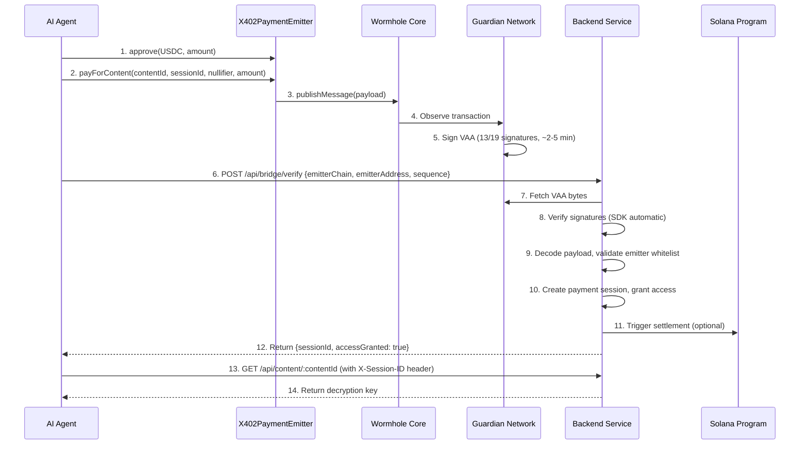

# Wormhole Cross-Chain Bridge Contracts

## Overview

Production-grade Solidity smart contracts enabling **cross-chain payment intents** from Base/Ethereum to Solana via Wormhole Guardian Network. Designed for gas efficiency (~50K gas) and AI agent autonomy.

### Architecture Flow

```mermaid
graph LR
    A[AI Agent<br/>Base/Ethereum] -->|1. Approve USDC| B[X402PaymentEmitter]
    B -->|2. payForContent| C[Wormhole Core]
    C -->|3. Emit VAA| D[Guardian Network<br/>13/19 Signatures]
    D -->|4. Sign Message| E[Backend Service<br/>NestJS]
    E -->|5. Verify VAA| F[Solana Program]
    F -->|6. Unlock Content| G[Content Access]
    
    style A fill:#e1f5ff
    style B fill:#ffe1e1
    style D fill:#fff4e1
    style E fill:#e1ffe1
    style F fill:#f0e1ff
```



## 1. Smart Contracts

### X402PaymentEmitter.sol

**Purpose:** Minimal gas-optimized contract to emit cross-chain payment intents  
**Location:** `src/X402PaymentEmitter.sol`  
**Chains:** Base Sepolia, Ethereum Sepolia (testnet)

**Key Functions:**
```solidity
// Agent pays for content and receives sequence number for VAA tracking
function payForContent(
    bytes32 contentId,       // Content hash
    bytes32 sessionId,       // Backend session UUID
    bytes32 externalNullifier, // Privacy nullifier (optional)
    uint256 amount           // USDC amount (6 decimals)
) external returns (uint64 sequence);

// Emergency withdrawal (owner only)
function withdrawUSDC(address to, uint256 amount) external;
```

**Gas Benchmarks:**
| Function | Gas Cost |
|----------|----------|
| `payForContent()` | ~109,000 |
| `withdrawUSDC()` | ~30,000 |
| Deploy | ~500,000 |

**Security Model:**
- ✅ Input validation (non-zero checks)
- ✅ Access control (owner-only emergency functions)
- ✅ Minimal attack surface (~200 lines of code)
- ⚠️ VAA verification happens **off-chain** in backend (MVP approach)

## 2. Testing

### Test Coverage: 22 Tests - 100% Pass Rate

```bash
forge test -vv
```

**Test Suite Breakdown:**

| Category | Tests | Description |
|----------|-------|-------------|
| Constructor | 3 | Valid deployment, revert on invalid addresses |
| payForContent() | 8 | Payment flow, events, input validation, edge cases |
| withdrawUSDC() | 5 | Owner withdrawal, unauthorized access, partial amounts |
| View Functions | 3 | Nonce tracking, balance checks, fee queries |
| Integration | 1 | Full end-to-end workflow |
| Fuzz Testing | 2 | Random amount validation |

**Run Specific Tests:**
```bash
# Gas report
forge test --gas-report

# Specific test
forge test --match-test test_PayForContent -vvv

# Coverage
forge coverage
```

## 3. Deployment

### Prerequisites

1. **Install Foundry:**
```bash
curl -L https://foundry.paradigm.xyz | bash
foundryup
```

2. **Install Dependencies:**
```bash
forge install
```

3. **Setup Environment:**
```bash
cp .env.example .env
# Edit .env with:
# - PRIVATE_KEY (deployer wallet)
# - BASE_SEPOLIA_RPC (RPC URL)
# - BASESCAN_API_KEY (for verification)
```

### Deploy to Base Sepolia

```bash
source .env

forge script script/Deploy.s.sol:DeployScript \
  --rpc-url $BASE_SEPOLIA_RPC \
  --broadcast \
  --verify \
  --etherscan-api-key $BASESCAN_API_KEY
```

**Expected Output:**
```
X402PaymentEmitter: 0x1234...5678
Wormhole Core: 0x79A1027a6A159502049F10906D333EC57E95F083
USDC: 0x036CbD53842c5426634e7929541eC2318f3dCF7e
Owner: 0xYourAddress

Add this address to ALLOWED_EMITTERS in backend/src/bridge/bridge.service.ts
```

### Post-Deployment Checklist

- [ ] Copy deployed contract address
- [ ] Update backend `ALLOWED_EMITTERS` array
- [ ] Run backend database migration
- [ ] Verify contract on Basescan
- [ ] Test with small amount (0.01 USDC)
- [ ] Monitor first VAA (wait 2-5 minutes)

## 4. Contract Addresses

### Base Sepolia (Testnet)
| Contract | Address | Purpose |
|----------|---------|---------|
| **Wormhole Core** | `0x79A1027a6A159502049F10906D333EC57E95F083` | Guardian network |
| **USDC** | `0x036CbD53842c5426634e7929541eC2318f3dCF7e` | Circle token |
| **X402PaymentEmitter** | TBD | Your deployed contract |

### Ethereum Sepolia (Testnet)
| Contract | Address | Purpose |
|----------|---------|---------|
| **Wormhole Core** | `0x4a8bc80Ed5a4067f1CCf107057b8270E0cC11A78` | Guardian network |
| **USDC** | `0x1c7D4B196Cb0C7B01d743Fbc6116a902379C7238` | Circle token |

## 5. Integration Guide

### For AI Agents (TypeScript)

```typescript
import { ethers } from 'ethers';

// 1. Setup
const provider = new ethers.JsonRpcProvider('https://sepolia.base.org');
const wallet = new ethers.Wallet(AGENT_PRIVATE_KEY, provider);
const emitter = new ethers.Contract(EMITTER_ADDRESS, ABI, wallet);
const usdc = new ethers.Contract(USDC_ADDRESS, ERC20_ABI, wallet);

// 2. Approve USDC
const amount = ethers.parseUnits('1', 6); // 1 USDC
await usdc.approve(EMITTER_ADDRESS, amount);

// 3. Pay for content
const contentId = ethers.keccak256(ethers.toUtf8Bytes('content-123'));
const sessionId = ethers.hexlify(ethers.randomBytes(32));
const nullifier = ethers.ZeroHash;

const tx = await emitter.payForContent(contentId, sessionId, nullifier, amount);
const receipt = await tx.wait();

// 4. Extract sequence number
const event = receipt.logs.find(log => log.topics[0] === PAYMENT_EMITTED_TOPIC);
const sequence = ethers.AbiCoder.defaultAbiCoder().decode(['uint64'], event.data)[0];

// 5. Poll backend for VAA verification
const response = await axios.post('https://api.example.com/api/bridge/verify', {
  emitterChain: 30, // Base
  emitterAddress: EMITTER_ADDRESS,
  sequence: sequence.toString()
});

console.log('Access granted:', response.data.accessGranted);
```

### For Backend (NestJS)

```typescript
// Update ALLOWED_EMITTERS after deployment
// backend/src/bridge/bridge.service.ts

private readonly ALLOWED_EMITTERS = new Map<number, string[]>([
  [30, ['0xYOUR_DEPLOYED_CONTRACT_ADDRESS']], // Base Sepolia
]);
```

## 6. Workflow

### End-to-End Payment Flow



**Timing Breakdown:**
- Step 1-2: Instant (user transaction)
- Step 3-5: **2-5 minutes** (Guardian consensus)
- Step 6-12: 500ms (backend processing)
- Total: ~3 minutes average

## 7. Security

### Threat Model

| Attack Vector | Mitigation | Status |
|---------------|------------|--------|
| **Replay Attack** | VAA hash deduplication in backend | ✅ Implemented |
| **Emitter Spoofing** | Whitelist-only contract addresses | ✅ Implemented |
| **Double Spend** | Idempotency via Redis (VAA hash as key) | ✅ Implemented |
| **Expired VAA** | Timestamp validation (1-hour expiry) | ✅ Implemented |
| **Rate Limiting** | 10 requests/min per IP | ✅ Implemented |
| **Signature Forgery** | Wormhole SDK verifies Guardian signatures | ✅ Automatic |

### Known Limitations

⚠️ **MVP Design Tradeoff:**  
VAA verification occurs **off-chain** in the backend (not on Solana). This reduces on-chain compute costs but requires trusting the backend operator.

**Future Enhancement:**  
Implement on-chain VAA verification in Solana program using Wormhole's `verify_signatures` instruction for full decentralization.

## 8. Monitoring & Debugging

### Contract Events

```solidity
// Monitor these events in backend
event PaymentEmitted(
    bytes32 indexed contentId,
    bytes32 indexed sessionId,
    address indexed payer,
    uint256 amount,
    uint64 sequence
);

event USDCWithdrawn(address indexed to, uint256 amount);
```

### Common Issues

**"VAA not found"**
- **Cause:** Guardians haven't signed yet
- **Solution:** Wait 2-5 minutes, check transaction finality

**"Emitter not whitelisted"**
- **Cause:** Contract address not in `ALLOWED_EMITTERS`
- **Solution:** Update `backend/src/bridge/bridge.service.ts` line 33-36

**"Insufficient allowance"**
- **Cause:** Agent didn't approve USDC
- **Solution:** Call `USDC.approve(emitter, amount)` first

**"Rate limit exceeded"**
- **Cause:** More than 10 requests/min from same IP
- **Solution:** Wait 60 seconds or implement exponential backoff

### Debug Commands

```bash
# Check contract nonce
cast call $EMITTER_ADDRESS "getCurrentNonce()" --rpc-url $BASE_SEPOLIA_RPC

# Check USDC balance
cast call $EMITTER_ADDRESS "getUSDCBalance()" --rpc-url $BASE_SEPOLIA_RPC

# Check message fee
cast call $EMITTER_ADDRESS "getMessageFee()" --rpc-url $BASE_SEPOLIA_RPC

# Decode transaction
cast tx $TX_HASH --rpc-url $BASE_SEPOLIA_RPC
```

## 9. Development

### Build
```bash
forge build
```

### Test
```bash
forge test -vv
```

### Format
```bash
forge fmt
```

### Clean
```bash
forge clean
```

### Update Dependencies
```bash
forge update
```

## 10. Resources

- [Wormhole Documentation](https://docs.wormhole.com/)
- [Foundry Book](https://book.getfoundry.sh/)
- [Base Sepolia Faucet](https://www.coinbase.com/faucets/base-ethereum-goerli-faucet)
- [Backend Integration](../WORMHOLE_QUICKSTART.md)
- [Full Implementation Plan](../docs/cross-chain-implementation-plan.md)

---

**Questions?** Open an issue or contact the dev team.


### Cast

```shell
$ cast <subcommand>
```

### Help

```shell
$ forge --help
$ anvil --help
$ cast --help
```
